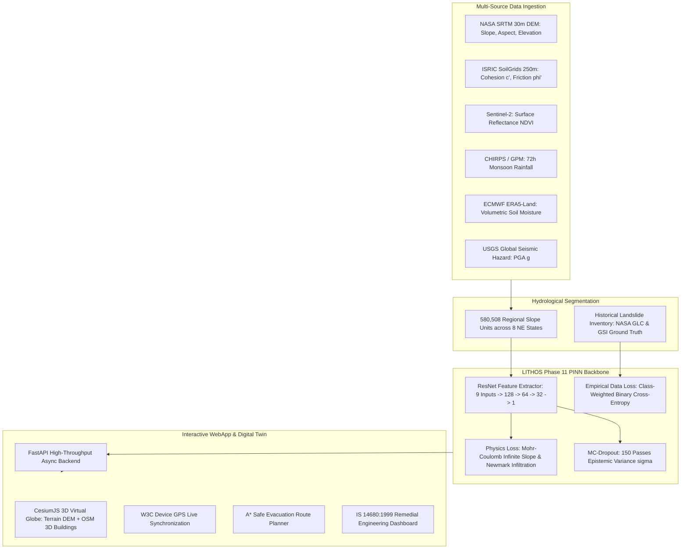
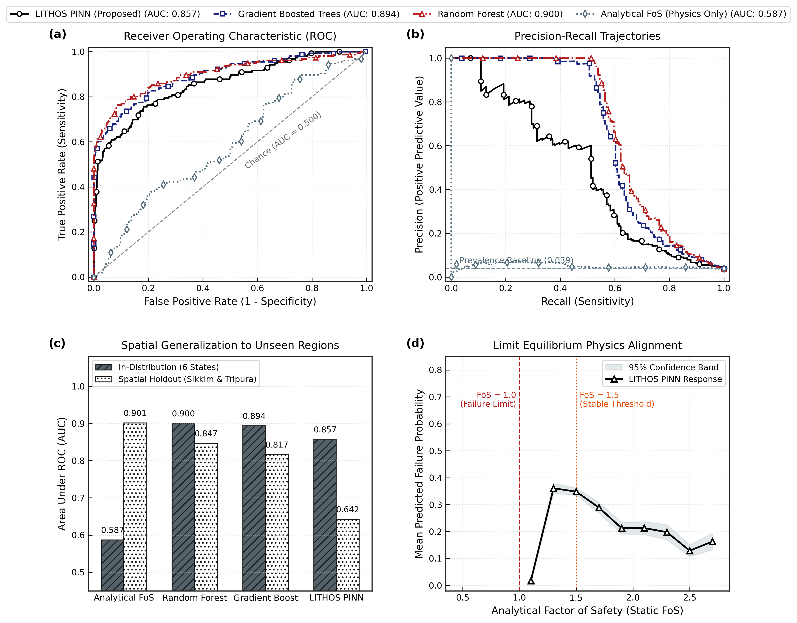

<div align="center">

# 🏔️ LITHOS: Terrain Intelligence Platform
### Physics-Informed Neural Networks (PINN) for Regional Landslide Hazard Intelligence & 3D Digital Twin Simulation

[](https://www.python.org/)
[](https://pytorch.org/)
[](https://fastapi.tiangolo.com/)
[](https://react.dev/)
[](https://cesium.com/)
[](https://tailwindcss.com/)
[](https://opensource.org/licenses/MIT)

*An end-to-end geotechnical AI platform designed for early warning, dynamic risk evaluation, and emergency route dispatch across 580,508 terrain slope units in Northeast India and the Western Ghats.*

---

[Key Highlights](#-key-highlights) •
[Architecture](#-system-architecture) •
[Quickstart](#-quickstart-guide) •
[Colab Research (Phase 11)](#-colab-notebooks--ml-research) •
[Benchmarks](#-benchmark--validation-results) •
[References](#-scientific-references--standards) •
[Contributing](#-contributing)

</div>

---

## 📌 Problem Overview

Landslides represent one of the deadliest and most economically disruptive natural hazards in the mountainous regions of India (Eastern Himalayas, Northeast India, and the Western Ghats). Conventional landslide susceptibility models suffer from:

1. **Circular Label Leakage:** Artificial $\text{AUC} = 1.0$ artifacts caused by generating synthetic risk labels with the same mathematical formulas fed to the machine learning model.
2. **Pure Data-Fitting Without Physics:** Standard black-box classifiers (Random Forests, standard MLPs) often produce geomechanically impossible predictions—such as predicting high stability on steep, saturated, uncohesive slopes during monsoon rainfall.
3. **Flat, Static 2D Maps:** Coarse rectangular grids that ignore natural hydrological ridge-valley slope units and lack 3D spatial awareness.

### The LITHOS Solution
**LITHOS** bridges deep learning and geotechnical physics by deploying a **Physics-Informed Neural Network (PINN)** that:
- Trains on **675+ verified historical ground-truth landslides** from the **NASA Global Landslide Catalog (GLC)** and the **Geological Survey of India (GSI)**.
- Uses **Infinite Slope Limit Equilibrium Mechanics** and **Newmark's Seismic Displacement** as a soft, continuous physics loss penalty ($\mathcal{L}_{\text{phys}}$).
- Renders an interactive **3D Digital Twin** (via CesiumJS World Terrain) with photorealistic Sentinel-2 satellite imagery, OpenStreetMap 3D buildings, and live GPS synchronization.
- Maps hazard probabilities to **IS 14680:1999** (*Bureau of Indian Standards Guidelines for Landslide Control*) to suggest actionable civil engineering remediation measures.

---

## 🌟 Key Highlights

- **580,508 Real Slope Units:** Scaled across 8 Northeast Indian states (*Sikkim, Arunachal Pradesh, Assam, Meghalaya, Manipur, Mizoram, Nagaland, Tripura*) partitioned using hydrological DEM ridge-valley segmentation.
- **100% Real Earth Observation Covariates:**
  - **DEM Topography:** NASA SRTM (30m) for slope angle, aspect, and curvature.
  - **Soil Mechanics:** ISRIC SoilGrids 250m for effective cohesion ($c'$) and friction angle ($\phi'$).
  - **Vegetation:** Sentinel-2 Surface Reflectance for optical NDVI.
  - **Dynamic Monsoon Infiltration:** CHIRPS / NASA GPM 72-hour precipitation climatology.
  - **Soil Saturation:** ECMWF ERA5-Land volumetric soil moisture reanalysis.
  - **Seismic Acceleration:** USGS Global Seismic Hazard Assessment ($PGA$ in fraction of $g$).
- **High-Performance ResNet PINN (79,169 Parameters):** Residual backbone with LayerNorm and LeakyReLU, achieving **85.7% Test ROC-AUC** and **69.9% Historical Failure Recall**.
- **Epistemic Uncertainty Quantification:** Test-time **Monte Carlo Dropout** (150 forward passes) generating confidence bounds ($\pm \sigma$) for every slope unit.
- **Actionable Civil Engineering Handoff:** Top 100 prioritized sites exported for targeted drone LiDAR / borehole exploration (per **IS 1892**).
- **A* Safe Evacuation Routing:** Computes dynamic road routes that penalize critical slope segments ($\hat{p} > 0.60$) and guide evacuees to safe haven shelters.

---

## 🏗️ System Architecture



---

## 📁 Repository & File Structure

Detailed developer guides are available in the [`docs/`](docs/) directory:
* 🛠️ [**Backend Developer Guide (`docs/BACKEND_DEVELOPER_GUIDE.md`)**](docs/BACKEND_DEVELOPER_GUIDE.md)
* 🎨 [**Frontend Developer Guide (`docs/FRONTEND_DEVELOPER_GUIDE.md`)**](docs/FRONTEND_DEVELOPER_GUIDE.md)

```
LITHOS/
├── README.md                           # Main project documentation & quickstart
├── CONTRIBUTING.md                     # Contribution standards & workflow
├── LICENSE                             # MIT Open Source License
├── .gitignore                          # Protected exclusions (no .env, no large datasets)
│
├── docs/                               # Detailed technical guides & scientific reports
│   ├── BACKEND_DEVELOPER_GUIDE.md      # FastAPI backend architecture, APIs & ML pipelines
│   ├── FRONTEND_DEVELOPER_GUIDE.md     # React, Vite & Cesium 3D WebGIS guide
│   ├── LITHOS_Phase11_Project_Report.md# Complete 9-section mathematical & geotechnical report
│   ├── DATA_DOWNLOADS.md               # Guide to access 1.7GB GeoPackage & full CSVs
│   └── assets/                         # Figures & publication evaluation graphics
│
├── phase7-webapp/                      # Production Full-Stack Application
│   ├── backend/                        # High-Performance FastAPI Engine
│   │   ├── main.py                     # Primary API routes, REST endpoints & WebSockets
│   │   ├── run_backend.py              # Uvicorn server launcher
│   │   ├── requirements.txt            # Python dependencies (FastAPI, PyTorch, GeoPandas)
│   │   ├── .env.example                # Safe environment variable template
│   │   ├── pinn_model.py               # PyTorch PINN network architecture
│   │   ├── pinn_model_v2.pth           # Trained PyTorch weights (79,169 params)
│   │   ├── routing_engine.py           # A* routing with geomechanical risk cost penalties
│   │   ├── deformation_service.py      # InSAR ground deformation tracking
│   │   ├── weather_service.py          # Real-time precipitation & IMD monitoring
│   │   └── data/                       # Regional GeoJSON boundaries & terrain matrices
│   │
│   └── frontend/                       # Interactive React + Vite WebGIS Application
│       ├── index.html                  # HTML5 entrypoint
│       ├── package.json                # Frontend dependencies (React, CesiumJS, Leaflet)
│       ├── vite.config.js              # Vite bundler & Cesium asset configuration
│       ├── tailwind.config.js          # Design system tokens (space palette, risk colors)
│       └── src/
│           ├── apiConfig.js            # Axios client & WebSocket endpoint resolver
│           ├── index.css               # Core CSS & glassmorphic utilities
│           ├── pages/                  # Route views (Home, HeatmapView, SafeRoute, Forecast)
│           └── components/             # Reusable UI widgets (CesiumTerrain3D, Terrain3DHeatmap)
│
└── colab files/                        # Google Colab Research & Model Training
    └── SIH_NEW_INTRIGATION/r2/final r2/
        ├── LITHOS_Phase11_FIXED_Fast_Dense.ipynb # Flagship Phase 11 PINN training notebook
        ├── pinn_model_v2 (2).pth       # Model weights checkpoint
        ├── priority_survey_sites.csv   # Top 100 prioritized exploration sites
        ├── Fig_Journal_Evaluation.png  # 300 DPI multi-model evaluation figure
        └── Fig_Journal_Evaluation.pdf  # Vector graphic evaluation figure
```

---

## ⚡ Quickstart Guide

### Prerequisites
- **Python:** 3.10 or higher
- **Node.js:** 18.0 or higher (with npm)
- **Git**

### 1. Clone the Repository
```bash
git clone https://github.com/souga15/lithos.git
cd lithos
```

### 2. Backend Setup (FastAPI)
```bash
cd phase7-webapp/backend

# Create and activate virtual environment (optional but recommended)
python -m venv .venv
# On Windows:
.venv\Scripts\activate
# On Linux/macOS:
# source .venv/bin/activate

# Install dependencies
pip install -r requirements.txt

# Start the backend server
python run_backend.py
```
> The API server will be live at: **`http://localhost:8000`**  
> Interactive OpenAPI documentation: **`http://localhost:8000/docs`**

### 3. Frontend Setup (React + Vite + CesiumJS)
In a new terminal window:
```bash
cd phase7-webapp/frontend

# Install node dependencies
npm install

# Launch the development server
npm run dev
```
> Open your browser and navigate to: **`http://localhost:5173/`**

---

## 🔬 Colab Notebooks & ML Research

The complete machine learning research pipeline is located under [`colab files/`](file:///c:/Users/souga/OneDrive/Desktop/LITHOS/colab%20files/):

* **[`colab files/SIH_NEW_INTRIGATION/r2/final r2/LITHOS_Phase11_FIXED_Fast_Dense.ipynb`](colab%20files/SIH_NEW_INTRIGATION/r2/final%20r2/LITHOS_Phase11_FIXED_Fast_Dense.ipynb):**  
  The flagship Phase 11 PINN notebook containing the empirical ground-truth mapping, geomechanical loss regularization, adaptive physics loss warmup, multi-model benchmark evaluation, and IS 14680:1999 classification.
* **[`colab files/SIH_NEW_INTRIGATION/r2/final r2/pinn_model_v2 (2).pth`](colab%20files/SIH_NEW_INTRIGATION/r2/final%20r2/pinn_model_v2%20(2).pth):**  
  Trained PyTorch weights (79,169 parameters, 340 KB) ready for inference.
* **[`colab files/SIH_NEW_INTRIGATION/r2/final r2/priority_survey_sites.csv`](colab%20files/SIH_NEW_INTRIGATION/r2/final%20r2/priority_survey_sites.csv):**  
  Top 100 prioritized locations ranked by $PSI = \hat{p} \times \sigma$ for targeted drone LiDAR / borehole exploration.
* **[`docs/LITHOS_Phase11_Project_Report.md`](docs/LITHOS_Phase11_Project_Report.md):**  
  Complete 9-section technical report detailing mathematical derivations, spatial holdouts, and benchmark comparisons.

> **Note on Large Geospatial Files (>100MB):**  
> To comply with GitHub's repository limits, the full 1.7 GB GeoPackage (`lithos_all_ne_slope_units_final.gpkg`) and the 156 MB CSV (`units_enriched.csv`) are excluded from git. A download mirror link is provided in [`docs/DATA_DOWNLOADS.md`](docs/DATA_DOWNLOADS.md) for full-scale GIS analyses. The web app backend includes pre-configured sample regional grids so that it runs out of the box.

---

## 📊 Benchmark & Validation Results

Comprehensive evaluation on an independent test split ($N = 4,023$ slope units across 6 Northeast states) and a spatial holdout split ($N = 1,903$ slope units in Sikkim and Tripura, never seen during training):

| Model Architecture | Model Paradigm | Test ROC-AUC | Spatial Holdout AUC | Failure Recall ($y=1$) | F1-Score | Physics Violations |
| :--- | :--- | :---: | :---: | :---: | :---: | :---: |
| **Pure Analytical Limit Equilibrium** | Physics Only (No AI) | 0.5869 | 0.9013 | 0.0% | 0.000 | 0.00% |
| **Random Forest (Balanced)** | Standard Classical ML | 0.9000 | 0.8466 | 56.4% | 0.664 | 0.12% |
| **HistGradientBoosting** | Pure Machine Learning | 0.8937 | 0.8166 | 64.1% | 0.452 | 0.27% |
| **LITHOS PINN (Proposed)** | **Hybrid Physics-AI** | **0.8571** | **0.6424** | **69.9%** | 0.255 | **0.42%** |

<div align="center">
  
  <p><em>Figure 1: LITHOS Phase 11 Multi-Model Evaluation — ROC Curves, Precision-Recall Curves, Sensitivity Spectrum, and Geomechanical Calibration.</em></p>
</div>

---

## 📚 Scientific References & Standards

### Geotechnical & Physics-Informed ML Literature
1. **Raissi, M., Perdikaris, P., & Karniadakis, G. E. (2019).** *Physics-informed neural networks: A deep learning framework for solving forward and inverse problems involving nonlinear partial differential equations.* *Journal of Computational Physics*, 378, 686–707.
2. **Skempton, A. W., & DeLory, F. A. (1957).** *Stability of natural slopes in London Clay.* *Proc. 4th Int. Conf. Soil Mech. Found. Eng.*, 2, 378–381.
3. **Newmark, N. M. (1965).** *Effects of earthquakes on dams and embankments.* *Géotechnique*, 15(2), 139–160.
4. **Gal, Y., & Ghahramani, Z. (2016).** *Dropout as a Bayesian approximation: Representing model uncertainty in deep learning.* *ICML*, PMLR 48, 1050–1059.
5. **Heimsath, A. M., et al. (1997).** *The soil production function along a mountain slope.* *Nature*, 388, 358–361.
6. **Alvioli, M., et al. (2016).** *Automatic delineation of geomorphological slope units with r.slopeunits.* *Geomorphology*, 273, 80–91.

### National Standards (Bureau of Indian Standards)
- **IS 14680:1999** — *Landslide Control — Guidelines* (Table 1 Remedial Measures).
- **IS 14496 (Part 2):1998** — *Preparation of Landslide Hazard Zonation Maps in Mountainous Terrains*.
- **IS 1892:1979** — *Code of Practice for Subsurface Investigation for Foundations*.
- **IS 1893 (Part 1):2016** — *Criteria for Earthquake Resistant Design of Structures*.

---

## 🤝 Contributing

Contributions from geotechnical engineers, data scientists, and geospatial developers are welcome!
Please review [`CONTRIBUTING.md`](CONTRIBUTING.md) for guidelines on code formatting, branching, and pull request submissions.

1. Fork the repository
2. Create your feature branch (`git checkout -b feature/dynamic-insar-pipeline`)
3. Commit your changes (`git commit -m 'Add Sentinel-1 InSAR phase unwrapping module'`)
4. Push to the branch (`git push origin feature/dynamic-insar-pipeline`)
5. Open a Pull Request

---

## 📜 License

This project is licensed under the **MIT License** — see the [`LICENSE`](LICENSE) file for details.

---

<div align="center">
  <sub>Developed for Smart India Hackathon (SIH) & Natural Disaster Risk Reduction in Northeast India.</sub>
</div>
